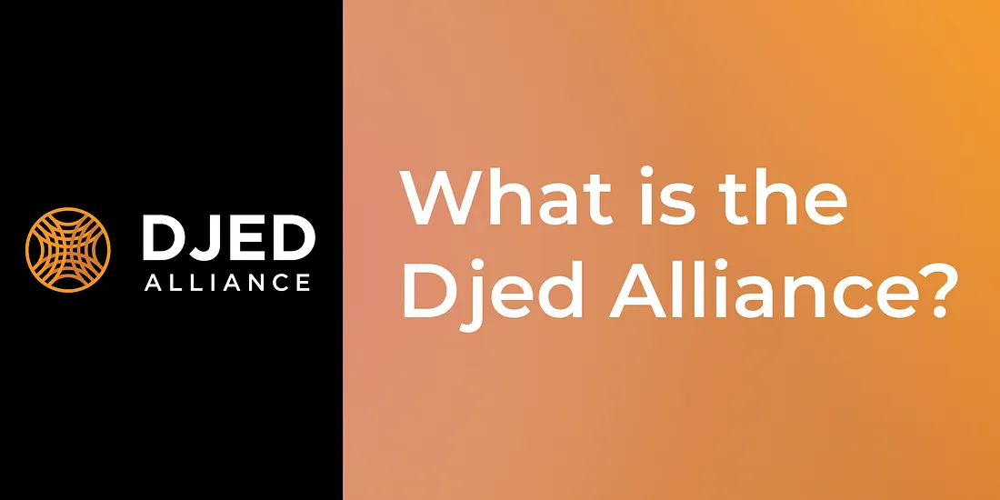

# Stablecoins: The Key to a Stable Decentralized Economy

Most cryptocurrencies are speculative and volatile, making them risky for transactions. Stablecoins, pegged to fiat currencies or assets like cryptocurrencies, aim to address this volatility. However, many stablecoins struggle to maintain their value during market downturns, even if they’re fiat-backed. Without a reliable medium for transaction, mainstream adoption of the decentralized economy is challenging.

# Djed Alliance: Pioneering Stability

The Djed Alliance is a decentralized collective researching and developing Djed-based stablecoins. Its mission is to bring stability to the digital economy by using the Djed Stablecoin Protocol on various blockchain networks.

# What is the Djed Stablecoin Protocol?

The Djed Stablecoin Protocol was [<ins>developed by expert engineers</ins>](https://iohk.io/en/research/library/papers/djed-a-formally-verified-crypto-backed-pegged-algorithmic-stablecoin/) from [<ins>Ergo</ins>](https://ergoplatform.org/en/), [<ins>Emurgo</ins>](https://www.emurgo.io/), and [<ins>Input Output</ins>](https://iohk.io/).

Djed functions akin to an autonomous bank, utilizing a crypto-backed algorithmic approach that has been formally verified using techniques such as bounded model checking and interactive theorem proving. By employing formal verification methods, Djed significantly reduces potential errors and vulnerabilities in its framework, enhancing the stablecoin’s security and reliability. These methods work by rigorously analyzing the protocol to identify and eliminate logical errors, ensuring that the system behaves as intended under various conditions.

# Defining True Stability

- **Peg maintenance:** Keeps the stablecoin’s price closely tied to its target.  
- **Market crash resilience:** Withstands price drops without losing its peg.  
- **Solvency:** Always has positive equity to meet its obligations.  
- **Prevents bank runs:** Deters mass sell-offs.  

# Djed Deployments

Djed is deployed across several blockchains and tested under various conditions.

**[<ins>SigmaUSD</ins>](https://sigmausd.io/#/) on Ergo:** Launched on a UTxO-based blockchain, SigmaUSD has maintained its stability through all market crashes since its launch. Ergo’s innovative approach to smart contracts, combining Proof-of-Work and an enhanced UTxO model, facilitated SigmaUSD’s development, kickstarting Ergo’s DeFi ecosystem. This deployment of Djed is backed by ERG, the native currency of Ergo.

**[<ins>Milkomeda Djed Osiris</ins>](https://milkomeda-c1.djed.one/):** The first implementation in the Solidity programming language. Building on lessons from the SigmaUSD deployment on Ergo, the Osiris version of Djed allows for both reservecoins and stablecoins to be sold back simultaneously to the Djed contract at any time, regardless of the reserve ratio, as long as the sale does not lower it. The first deployment of this implementation, on the Milkomeda EVM-compatible sidechain of Cardano, uses mADA.

**[<ins>Djed Powered by COTI on Cardano</ins>](https://djed.xyz/):** Cardano’s native crypto-backed stablecoin, developed by IOG and operated by COTI. This deployment of Djed is backed by ADA, Cardano’s native currency, and is implemented in Plutus, Cardano’s main smart contract language.

**[<ins>Zephyr</ins>](https://zephyrprotocol.com/network):** A privacy-centric stablecoin blending Monero’s privacy features with Djed’s stability. As the first Djed protocol implementation integrated directly into a blockchain’s ledger rules, Zephyr employs a novel version of Djed (“Shu”) that uses two oracles for enhanced resilience against price manipulations and oracle delays.

# Create Your Own Stablecoin with Djed

The need for stablecoins extends across all blockchains, serving as the backbone for transactions, payments, and remittances, and as a foundation for decentralized finance. The Djed protocol provides a decentralized alternative to fiat-backed stablecoins, free from risks like operator insolvency and network bridging hacks. A Djed-based stablecoin can provide more utility to a blockchain’s native cryptocurrency and offer stability during market volatility.

# About the Djed Alliance

The [<ins>Djed Alliance</ins>](https://djed.one/) aims to stabilize the digital economy through the Djed Stablecoin Protocol.  

The Djed Stablecoin Protocol is deployed across multiple networks and can be used to create your stablecoin. Join our [<ins>growing community</ins>](https://discord.com/invite/ggxP4ttHgN) and together, we will advance the future of the decentralized economy.
